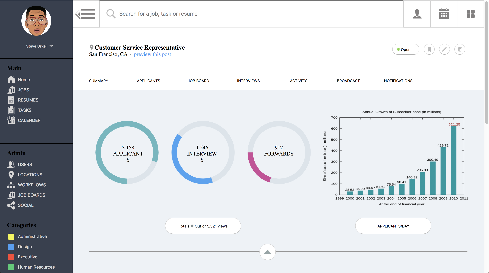

# StaticComp
The purpose of this static comp was to gain extensice practice in reponsive web design using a CRM sytle static page. The challenges of this projects were learning FlexBox and how to use @media queries effectively.   

## Getting Started
clone down the repo.

### Running
cd into directory.
open index.html from terminal.

## Built With
HTML5 & CSS3(flex-box).

## Authors
***Gavin Love** - *Initial work* - [gavin-love](hhttps://github.com/gavin-love)
